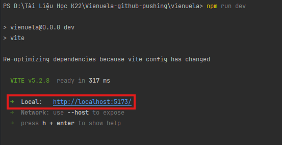
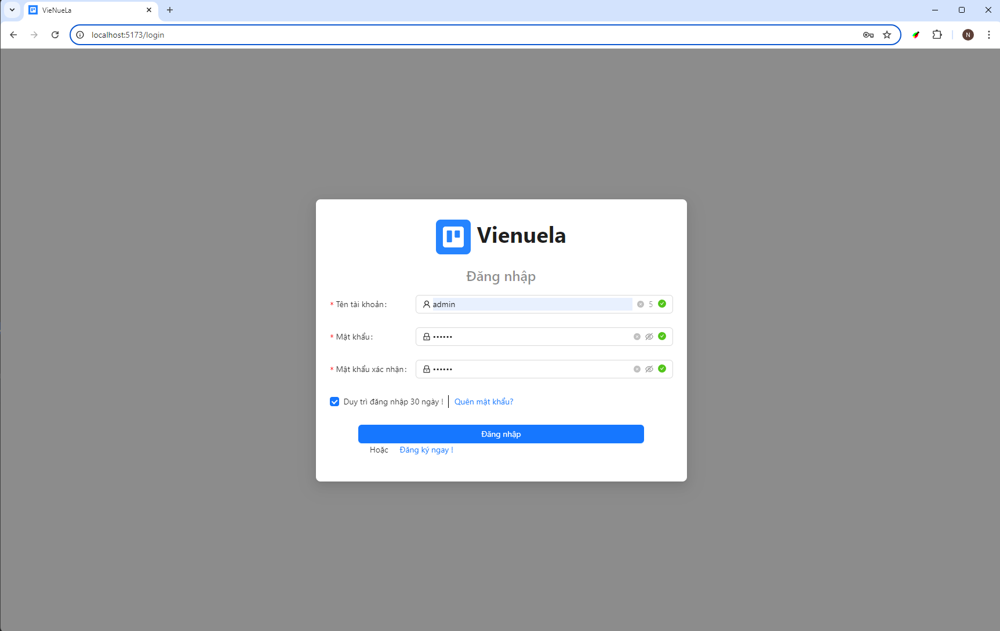
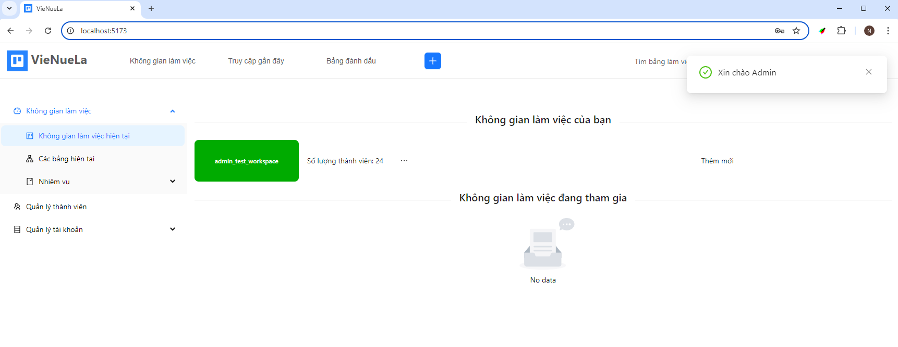
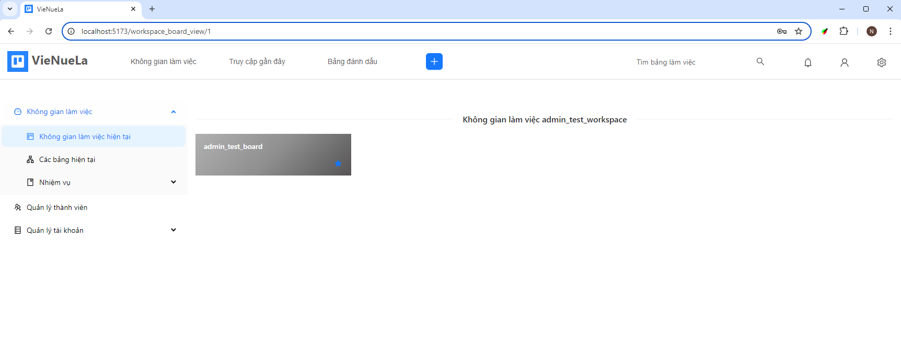
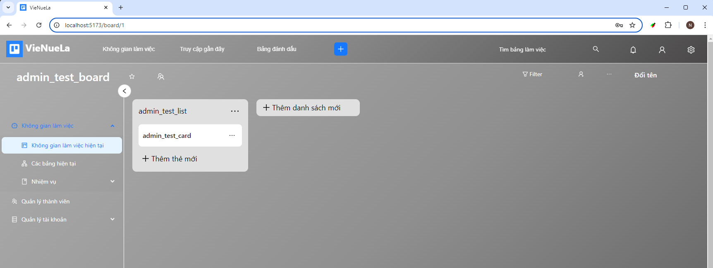
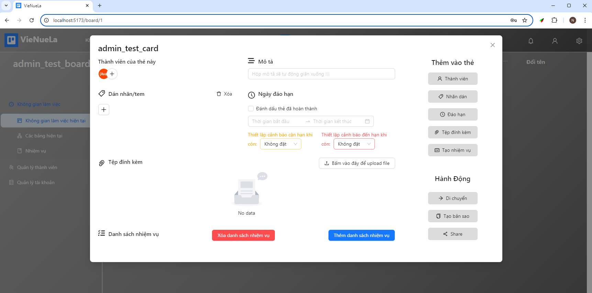

# Vienula (A Trello Clone used Vue + Laravel)
*-- This repository contains Frontend development for project Vienuela. --*

## Getting start
These instructions will get you a copy of the project up and running on your local machine for development and testing purposes.

### Prerequisite
* Git
* Nodejs version: 18.16.0 and above
* Vienuela database backend. 
To setup database for this project please visit
  **[this Vue backend project](https://github.com/Newt-Louis/Vienuela.git)**

### Install

Clone the git repository on your computer.
> $ git clone https://github.com/Newt-Louis/Vienuela-FE.git

You can also download the entire repository as a zip file and unpack in on your computer if you do not have git

After cloning the application, you need to install it's dependencies.

> $ cd Vienuela-FE

> $ npm install

### Setup 
* After waiting for NPM completely installed. You can run this project locally
> $ npm run dev

Press ctrl + click into the local link like this:

* You will need an account to log in as it has been secured by the navigation protection system
> id: admin
> 
> password: 123456

Once you have completed installing the front-end and back-end for the project, the application will work as follows:

